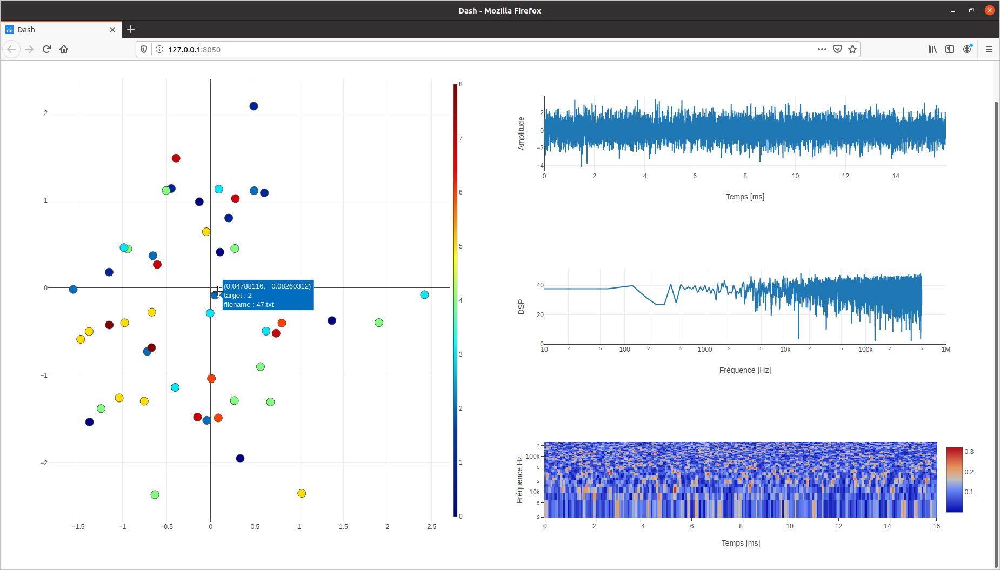

# Interactive visualization
This program works with .txt data.
Code is based on numpy, scipy, plotly, dash, pandas and sounddevice. 

## Generation CSV
key words : x, y, target, filename

### Example
To generete datas and CSV (example) run
```
python generation_csv.py
```

## Run
```
python main.py --metadatapath out.csv --datapath data/
```



## Credits
Nicolas Pajusco, 2020
